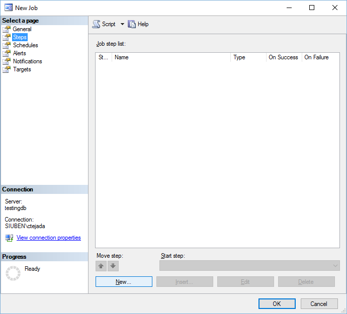
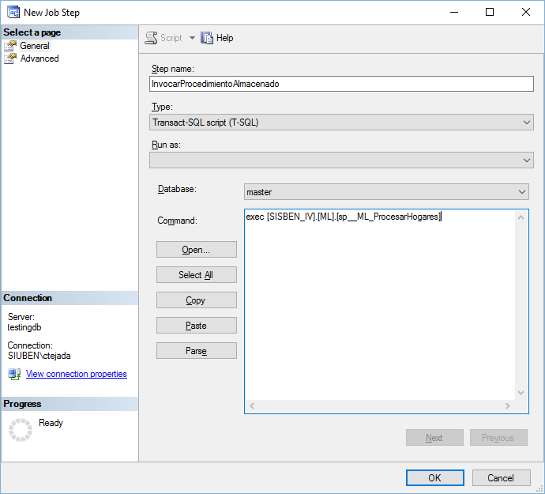
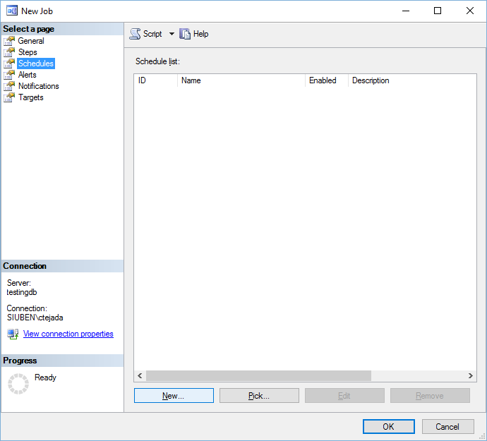
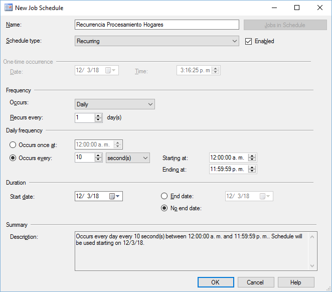
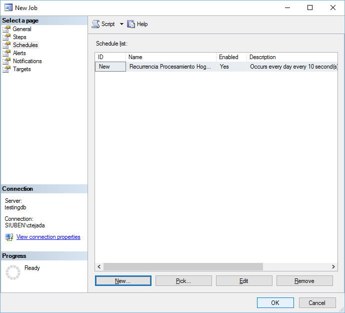

# Agente SQL Clasificador de Hogares SISBEN

*Esta herramienta digital forma parte del catálogo de herramientas del **Banco Interamericano de Desarrollo**. Puedes conocer más sobre la iniciativa del BID en [code.iadb.org](code.iadb.org)*

## Descripción

Este agente es un procedimiento almacenado de SQL Server (que se invoca a traves de un trabajo), el cual se encarga de procesar los datos de los hogares aún no procesados, y de clasificar cada hogar como regular o irregular.

### Guía de usuario
---
Para visualizar los resultados del algoritmo diríjase al repositorio del [visualizador de indicadores](https://github.com/EL-BID/Supervision-SISBEN-ML "Visualizador de Indicadores QAML").

### Guía de instalación
---
Para instalar/configurar el agente clasificador de hogares, primero debe ejecutar el script [create.sql](src/create.sql "create script"). Este script se encargará de crear la estructura de datos base para el algoritmo (y el visualizador) poder operar. Luego de crear la base de datos con el script [create.sql](src/create.sql "create script").

Si se generan actualizaciones a los objetos, el script [create.sql](src/create.sql "create script") será actualizado y también a la vez se agregaran nuevos scripts de migración que serán citados detalladamente en esta sección.

Después de haber creado la base de datos y los objetos de la misma, tiene que crear un trabajo en el agente de SQL Server, el cual invocará recurrentemente el procedimiento almacenado de clasificación ([ML].[sp__ML_ProcesarHogares]). Para crear/configurar el trabajo en el agente de SQL Server, siga los pasos descrito en la siguiente sub-sección.

#### Pasos para crear job

Primero inicie la creación de un nuevo trabajo dentro del agente de SQL Server.

Haga clic en la opción **Steps**.

Haga clic en la opción **New...**

Llene el campo **name**, luego indique la base de datos en el campo **Database:** y finalmente escriba la consulta  para invocar el procedimiento almacenado. Clic OK.

Haga clic en el ítem del panel de la izquierda que dice **Schedules**.

Haga clic en el botón **New..** para agregar un nuevo horario.

Llene los datos de  la programación de la recurrencia del trabajo. Clic OK.

Clic OK para finalizar.

### Cómo contribuir
---
Si deseas contribuir con este proyecto, por favor lee las siguientes guías que establece el [BID](https://www.iadb.org/es "BID"):

* [Guía para Publicar Herramientas Digitales](https://el-bid.github.io/guia-de-publicacion/ "Guía para Publicar") 
* [Guía para la Contribución de Código](https://github.com/EL-BID/Plantilla-de-repositorio/blob/master/CONTRIBUTING.md "Guía de Contribución de Código")

### Código de conducta 
---
Puedes ver el código de conducta para este proyecto en el siguiente archivo [CODE*OF*CONDUCT.md](CODEOFCONDUCT.md).

### Autor
---
Este software ha sido desarrollado por *Carlos Tejada ([carlostejada@gmail.com](mailto:carlostejada@gmail.com))* bajo el proyecto [CO-T1418](https://www.iadb.org/es/project/CO-T1418 "CO-T1418")-P001, fondos ATN/OC-16168-CO, Contrato No. 001, a través del [BID](https://www.iadb.org/es "BID") para el [DNP Colombia](https://www.dnp.gov.co/ "DNP").

### Licencia 
---
Los detalles de licencia para este código fuente se encuentran en el archivo [LICENSE.md](LICENSE.md).
