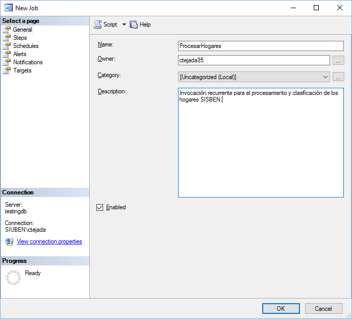

# Agente SQL del Clasificador de datos atípicos

*Esta herramienta digital forma parte del catálogo de herramientas del **Banco Interamericano de Desarrollo**. Puedes conocer más sobre la iniciativa del BID en [https://knowledge.iadb.org/en/code-development](https://knowledge.iadb.org/en/code-development)*

## Descripción

Este agente es un procedimiento almacenado de SQL Server (que se invoca a traves de un trabajo), el cual se encarga de procesar los datos de los hogares aún no procesados, y de clasificar cada hogar como regular o irregular.

### Guía de usuario
---
Para visualizar los resultados del algoritmo diríjase al repositorio del [visualizador de indicadores](https://github.com/EL-BID/Supervision-SISBEN-ML "Visualizador de Indicadores QAML").

### Guía de instalación
---
Para instalar/configurar el agente clasificador de hogares, primero debe ejecutar el script [create.sql](src/create.sql "create script"). Este script se encargará de crear la estructura de datos base para el algoritmo (y el visualizador) poder operar. Luego de crear la base de datos con el script [create.sql](src/create.sql "create script").

Si se generan actualizaciones a los objetos, el script [create.sql](src/create.sql "create script") será actualizado y también a la vez se agregaran nuevos scripts de migración que serán citados detalladamente en esta sección.

Después de haber creado la base de datos y los objetos de la misma, tiene que crear un trabajo en el agente de SQL Server, el cual invocará recurrentemente el procedimiento almacenado de clasificación ([ML].[sp__ML_ProcesarHogares]). Para crear/configurar el trabajo en el agente de SQL Server, siga los pasos descrito en la siguiente sub-sección.

#### Pasos para crear job

Primero inicie la creación de un nuevo trabajo dentro del agente de SQL Server.

Haga clic en la opción **Steps**.

Haga clic en la opción **New...**

Llene el campo **name**, luego indique la base de datos en el campo **Database:** y finalmente escriba la consulta  para invocar el procedimiento almacenado. Clic OK.

Haga clic en el ítem del panel de la izquierda que dice **Schedules**.

Haga clic en el botón **New..** para agregar un nuevo horario.

Llene los datos de  la programación de la recurrencia del trabajo. Clic OK.

Clic OK para finalizar.

### Cómo contribuir
---
Si deseas contribuir con este proyecto, por favor lee las siguientes guías que establece el [BID](https://www.iadb.org/es "BID"):

* [Guía para Publicar Herramientas Digitales](https://el-bid.github.io/guia-de-publicacion/ "Guía para Publicar") 
* [Guía para la Contribución de Código](https://github.com/EL-BID/Plantilla-de-repositorio/blob/master/CONTRIBUTING.md "Guía de Contribución de Código")

### Código de conducta 
---
Puedes ver el código de conducta para este proyecto en el siguiente archivo [CODE*OF*CONDUCT.md](CODEOFCONDUCT.md).

### Autor
---
Este software ha sido desarrollado por *Carlos Tejada ([carlostejada@gmail.com](mailto:carlostejada@gmail.com))* bajo el proyecto [CO-T1418](https://www.iadb.org/es/project/CO-T1418 "CO-T1418")-P001, fondos ATN/OC-16168-CO, Contrato No. 001, a través del [BID](https://www.iadb.org/es "BID") para el [DNP Colombia](https://www.dnp.gov.co/ "DNP").

### Licencia 
---
Los detalles de licencia para este código fuente se encuentran en el archivo [LICENSE.md](LICENSE.md).

## Acknowledgments / Reconocimientos

**Copyright © [2025]. Inter-American Development Bank ("IDB"). Authorized Use.**  
The procedures and results obtained based on the execution of this software are those programmed by the developers and do not necessarily reflect the views of the IDB, its Board of Executive Directors or the countries it represents.

**Copyright © [2025]. Banco Interamericano de Desarrollo ("BID"). Uso Autorizado.**  
Los procedimientos y resultados obtenidos con la ejecución de este software son los programados por los desarrolladores y no reflejan necesariamente las opiniones del BID, su Directorio Ejecutivo ni los países que representa.

### Support and Usage Documentation / Documentación de Soporte y Uso

**Copyright © [2025]. Inter-American Development Bank ("IDB").** The Support and Usage Documentation is licensed under the Creative Commons License CC-BY 4.0 license. The opinions expressed in the Support and Usage Documentation are those of its authors and do not necessarily reflect the opinions of the IDB, its Board of Executive Directors, or the countries it represents.

**Copyright © [2025]. Banco Interamericano de Desarrollo (BID).** La Documentación de Soporte y Uso está licenciada bajo la licencia Creative Commons CC-BY 4.0. Las opiniones expresadas en la Documentación de Soporte y Uso son las de sus autores y no reflejan necesariamente las opiniones del BID, su Directorio Ejecutivo ni los países que representa.

### AI-Powered Services Disclaimer / Exención de responsabilidad por Servicios Impulsados por IA

The Software may include features which use, are powered by, or are an artificial intelligence system (“AI-Powered Services”), and as a result, the services provided via the Software may not be completely error-free or up to date. Additionally, the User acknowledges that due to the incorporation of AI-Powered Services in the Software, the Software may not dynamically (in “real time”) retrieve information and that, consequently, the output provided to the User may not account for events, updates, or other facts that have occurred or become available after the Software was trained. Accordingly, the User acknowledges that the use of the Software, and that any actions taken or reliance on such products, are at the User’s own risk, and the User acknowledges that the User must independently verify any information provided by the Software.

El Software puede incluir funciones que utilizan, están impulsadas por o son un sistema de inteligencia artificial (“Servicios Impulsados por IA”) y, como resultado, los servicios proporcionados a través del Software pueden no estar completamente libres de errores ni actualizados. Además, el Usuario reconoce que, debido a la incorporación de Servicios Impulsados por IA en el Software, este puede no recuperar información dinámicamente (en “tiempo real”) y que, en consecuencia, la información proporcionada al Usuario puede no reflejar eventos, actualizaciones u otros hechos que hayan ocurrido o estén disponibles después del entrenamiento del Software. En consecuencia, el Usuario reconoce que el uso del Software, y que cualquier acción realizada o la confianza depositada en dichos productos, se realiza bajo su propio riesgo, y reconoce que debe verificar de forma independiente cualquier información proporcionada por el Software.
